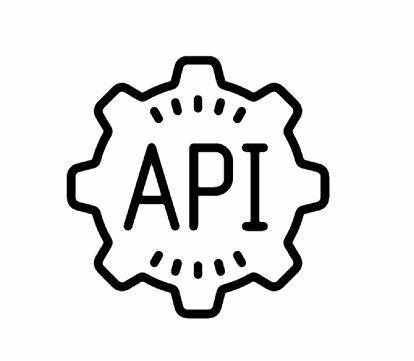
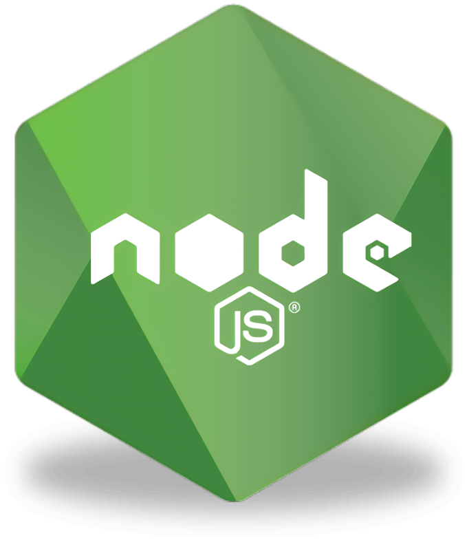

<h1>Hello world 👋🏾</h1>

<a class="badge-base__link LI-simple-link" href="https://www.linkedin.com/in/tobiloba-aina-78483822b/"> Aina Oluwatobiloba</a>

    
<h1>Welcome To KINGPIN's Profile 👑📍</h1>

### **What's my current role in tech?** </h2>

       { Front End Developer }

#### Connect with me

### About

Here are some basic things to know about KINGPIN 👑📍;

- 🔭 I’m currently working on acquiring new skills,
- 🌱 I’m currently learning Fullstack Web Development,
- 👯 I’m looking to collaborate on projects,
- 💬 Ask me about anything🌚,
- 📫 How to reach me: Email: ainatobi83@gmail.com, Phone: +2348080120121,
- 😄 Pronouns: He/Him/His,
- ⚡ Fun fact: I love Gaming.

### My Core Languages

<code></code>
<code></code>
<code></code>
<code></code>
<code></code>

#### Frameworks I Use

<code></code>
<code></code> <code></code>  
<code></code>
<code></code>
<code></code>

#### Tools I Use

<code></code>
<code></code>
<code></code>
<code></code>
<code></code>
<code></code>
<code></code>

  

#### Lifestyle

|  |  |
| ------------- | ------------- |

